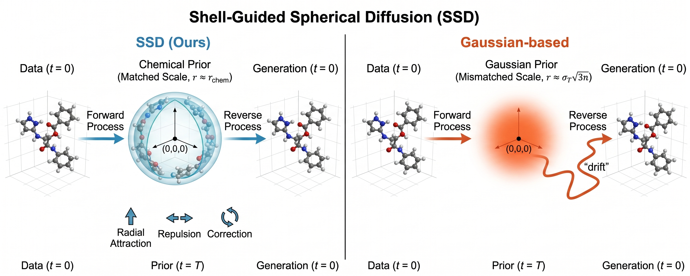
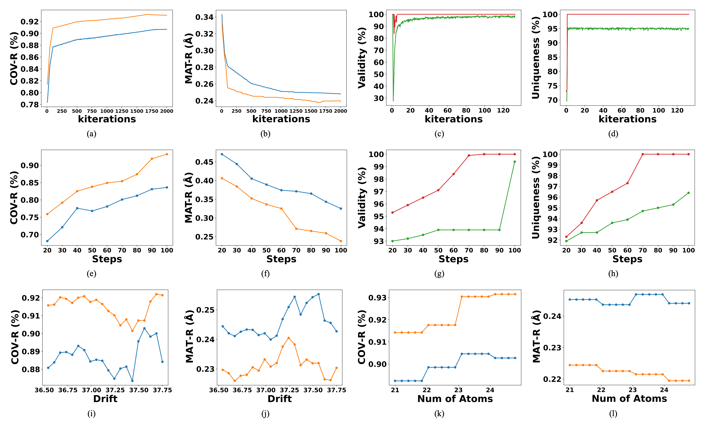
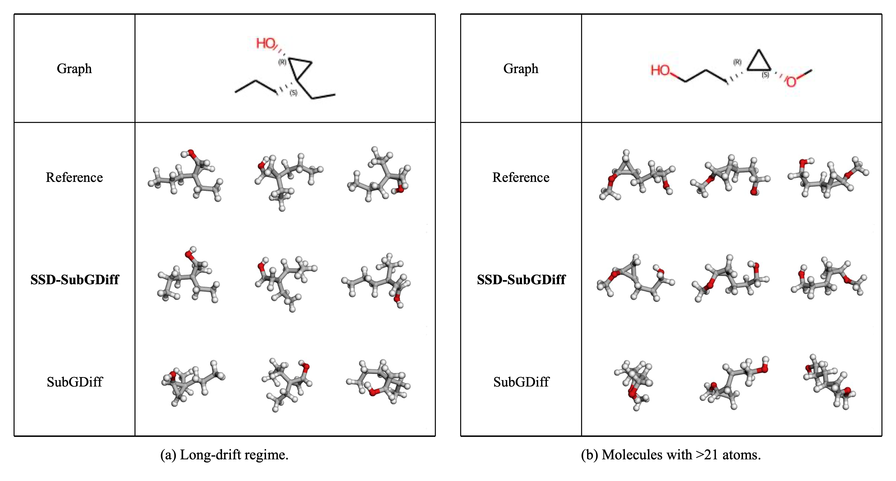

<!-- TODO before making the repository public: replace every href="TODO" / (TODO) link below (Paper, Poster, Slides). -->

# SSD: Shell-Guided Spherical Diffusion for Molecular Geometry Generation
<p align="center">
    Yun-Yen Chuang<sup>1,2</sup> · Chen-Sheng Gu<sup>1,2</sup> · Hung-Min Hsu<sup>3</sup> · Kevin Lin<sup>4</sup> · Ray-I Chang<sup>2</sup><br>
    <sup>1</sup>Maxora AI &nbsp; <sup>2</sup>National Taiwan University &nbsp; <sup>3</sup>University of Washington &nbsp; <sup>4</sup>Microsoft<br>
    <a href="TODO">[Paper]</a>
    <a href="TODO">[Poster]</a>
    <a href="TODO">[Slide]</a>
    <a href="https://zenodo.org/records/18398184">[Data &amp; Checkpoints]</a>
</p>

## Our Paper at NeurIPS 2026
This project is based on our paper accepted at the [40th Conference on Neural Information Processing Systems (NeurIPS 2026)](https://neurips.cc/), titled **"SSD: Shell-Guided Spherical Diffusion for Molecular Geometry Generation"**. You can find the paper [here](TODO).

## SSD
<p align="center">
  
</p>

**SSD vs. Gaussian-based diffusion.** *(Left)* SSD initializes on a chemically scaled spherical shell ($r_{\text{SSD}} \approx r_{\text{chem}}$) and follows a direct, stable pathway. The reverse process is guided by three structured drifts: radial attraction, short-range repulsion, and SE(3)-equivariant correction. *(Right)* Gaussian-based models drift toward a high-dimensional prior whose radius ($r_{\text{Gauss}} \approx \sigma_T\sqrt{3n}$) is set by dimensionality alone, which creates a severe scale mismatch with chemical reality and results in long, wandering trajectories.

Diffusion models for 3D molecular geometry almost always use an isotropic Gaussian prior. By the Gaussian Annulus Theorem, a $3n$-dimensional Gaussian concentrates on a thin shell of radius $\sigma_T\sqrt{3n}$. That radius depends on the noise level and the atom count, not on chemistry, so the prior does not match the molecule's actual size. The mismatch distorts score magnitudes, causes high spatial entropy and unstable early trajectories, and gets worse as $n$ grows.

**Shell-guided Spherical Diffusion (SSD)** is a model-agnostic framework that fixes this mismatch. It combines two jointly designed components:

- **Spherical-shell initialization.** Every state is centered to zero center of mass, and all atoms start on a spherical shell whose radius $r_{\text{SSD}}$ is calibrated to the mean radius of centered training conformations. $r_{\text{SSD}}$ is a fixed dataset-level constant: 6.37 Å for GEOM-QM9 and 21.16 Å for GEOM-Drugs. Atoms are assigned to shell points by a random permutation that is resampled for each trajectory.
- **Shell-aware dynamics** in both the forward and reverse processes:
  - **Radial attraction.** A normalized drift moves each atom at a uniform speed $\alpha_t$: toward its assigned shell point in the forward process, and toward the shell center in the reverse process. Unlike the exponential restoring force of Ornstein–Uhlenbeck dynamics, this gives a linear contraction that does not depend on distance.
  - **Short-range repulsion.** This term enforces a minimum interatomic separation $d_{\min}$ and prevents atoms from collapsing onto each other.
  - **SE(3)-equivariant correction.** The backbone's score network refines local geometry.

The reverse process combines these terms:

```math
d\mathbf{x}_t^{(i)} = \big[\mathbf{v}_{\mathrm{rad}}^{(i)} + \mathbf{v}_{\mathrm{rep}}^{(i)} + \mathbf{v}_{\mathrm{score}}^{(i)}\big]\,dt + \sigma_t\, d\bar{\mathbf{w}}_t^{(i)},
\qquad
\mathbf{v}_{\mathrm{rad}}^{(i)} = -\alpha_t\, \frac{\mathbf{x}_t^{(i)}}{\|\mathbf{x}_t^{(i)}\|}
```

The shell and the dynamics only work together: neither a shell alone nor radial fields alone gives SSD's stability or accuracy. SSD preserves SE(3)-equivariance by construction, adds **no learnable parameters**, and leaves each backbone's architecture, loss form, and training pipeline unchanged. Only the data-corruption process changes. We apply it to five coordinate-space backbones:

- **SSD-GeoDiff**, **SSD-SubGDiff**, **SSD-EDM**, and **SSD-MCF**, trained with denoising score matching.
- **SSD-Flow**, a coordinate-space flow-matching model, trained with flow matching.

<p align="center">
  
</p>

**SSD on QM9: convergence, step robustness, and long-range drift (Figure 2 in the paper).** Colors: Orange = SSD-SubGDiff, Blue = SubGDiff, Red = SSD-Flow, Green = SemlaFlow.

- **Row 1, faster convergence (a–d).** SSD converges faster and outperforms the Gaussian-based baselines across training iterations.
  - (a, b) Conditional generation: COV-R and MAT-R.
  - (c, d) Unconditional refinement: Validity and Uniqueness.
- **Row 2, robustness across sampling steps (e–h).** SSD stays ahead from 20 to 100 sampling steps.
- **Row 3, long-range Gaussian drift (i–l).** SSD-SubGDiff consistently outperforms SubGDiff once drift exceeds ~36.6 Å (i, j) or the molecule has more than 21 atoms (k, l).

<p align="center">
  
</p>

**Qualitative case studies on QM9, conditional generation (Figure 3 in the paper).** (a) Long-drift regime (drift > 36.6 Å). (b) Molecules with more than 21 atoms. SSD-SubGDiff produces stable, chemically plausible structures that match the reference. SubGDiff often produces distorted or unstable geometries.

## Main Results
Each backbone and its SSD variant is evaluated under that backbone's own protocol, with identical training and sampling budgets. Mean values are shown. **Bold** marks an improvement over the corresponding backbone, and "–" marks a metric not reported in the original paper. SSD entries are single runs (training seed 42). The paper's Table 1 also reports medians, and Table 3 reports three-seed statistics.

**Conditional generation, SubGDiff protocol** (COV in %, MAT in Å)

| Model | Dataset | COV-R ↑ | COV-P ↑ | MAT-R ↓ | MAT-P ↓ |
|:---|:---|:---:|:---:|:---:|:---:|
| GeoDiff | QM9 | 80.36 | 53.66 | 0.2820 | 0.6673 |
| SSD-GeoDiff | QM9 | **92.00** | **61.40** | **0.2425** | **0.4188** |
| GeoDiff | Drugs | 64.12 | 52.79 | – | – |
| SSD-GeoDiff | Drugs | **91.69** | **70.23** | 0.8463 | 1.1543 |
| SubGDiff | QM9 | 90.91 | 50.16 | 0.2460 | 0.6114 |
| SSD-SubGDiff | QM9 | **93.20** | **63.50** | **0.2380** | **0.4100** |
| SubGDiff | Drugs | 76.16 | – | 1.0003 | – |
| SSD-SubGDiff | Drugs | **92.50** | 71.10 | **0.8300** | 1.1400 |

**Conditional generation, MCF protocol** (COV in %, MAT in Å)

| Model | Dataset | COV-R ↑ | COV-P ↑ | MAT-R ↓ | MAT-P ↓ |
|:---|:---|:---:|:---:|:---:|:---:|
| MCF | QM9 | 95.00 | 93.70 | 0.1030 | 0.1190 |
| SSD-MCF | QM9 | **96.15** | **94.61** | **0.0993** | **0.1087** |
| MCF | Drugs | 84.70 | 66.80 | 0.3900 | 0.6180 |
| SSD-MCF | Drugs | **85.37** | **68.82** | **0.3792** | **0.6089** |

**Unconditional refinement, SemlaFlow protocol** (%)

| Model | Dataset | AtomStab ↑ | MolStab ↑ | Valid ↑ | Unique ↑ |
|:---|:---|:---:|:---:|:---:|:---:|
| EDM | QM9 | 98.7 | 82.0 | 91.9 | 98.9 |
| SSD-EDM | QM9 | **99.3** | **99.8** | **100.0** | **100.0** |
| EDM | Drugs | 81.3 | – | – | – |
| SSD-EDM | Drugs | **90.5** | 70.1 | 98.5 | 99.2 |
| SemlaFlow | QM9 | 99.9 | 99.7 | 99.4 | 95.4 |
| SSD-Flow | QM9 | 99.9 | **99.9** | **100.0** | **100.0** |
| SemlaFlow | Drugs | 99.8 | 97.3 | 93.9 | 100.0 |
| SSD-Flow | Drugs | 99.8 | **97.6** | **100.0** | 100.0 |

The gains from SSD grow with molecule size. They reach **+32.5 COV-R** on GEOM-Drugs molecules with ≥ 50 atoms, which is where Gaussian baselines degrade most.

<details>
<summary><b>Ablation: the shell and the dynamics are both required</b> (GEOM-QM9, SubGDiff protocol)</summary>

<br>

$r_{\text{Gauss}} = \sigma_T\sqrt{3n_{\text{med}}}$ is the Gaussian concentration radius at the median atom count, and $r_{\text{SSD}}$ is SSD's chemically calibrated radius.

| Variant | Init. / Prior | Dynamics | COV-R ↑ | COV-P ↑ | MAT-R ↓ | MAT-P ↓ |
|:---|:---|:---|:---:|:---:|:---:|:---:|
| (1) Gaussian baseline | Gaussian | v<sub>SubGD</sub> | 90.91 | 50.16 | 0.2460 | 0.6114 |
| (2) Gaussian + rep./corr. | Gaussian | v<sub>rep</sub> + v<sub>score</sub> | 90.95 | 50.20 | 0.2455 | 0.6098 |
| (3) Shell(r<sub>Gauss</sub>) | Shell(r<sub>Gauss</sub>) | None | 90.92 | 50.18 | 0.2462 | 0.6107 |
| (4) Shell(r<sub>Gauss</sub>) + SSD dyn. | Shell(r<sub>Gauss</sub>) | v<sub>rad</sub> + v<sub>rep</sub> + v<sub>score</sub> | 91.50 | 51.00 | 0.2443 | 0.6020 |
| **(5) SSD (ours)** | **Shell(r<sub>SSD</sub>)** | v<sub>rad</sub> + v<sub>rep</sub> + v<sub>score</sub> | **93.20** | **63.50** | **0.2380** | **0.4100** |

- Guidance terms alone cannot correct the radius mismatch (2).
- Projecting the Gaussian onto a dimension-derived shell changes almost nothing (3).
- Only a chemically calibrated shell combined with shell-consistent dynamics gives the full gain (5).
</details>

<details>
<summary><b>Trajectory stability and spatial entropy</b> (GEOM-QM9)</summary>

<br>

Two trajectory metrics are reported:

- **Radial deviation** $\mathbb{E}_t[\,|\lVert x_t\rVert - r_{\text{SSD}}|\,]$: how far a trajectory strays from the shell radius.
- **Path excess** $\mathrm{PathLen}/\lVert x_T - x_0\rVert$: actual trajectory length relative to the direct shell-to-structure displacement.

| Method | Regime | Radial dev. ↓ | Path excess ↓ |
|:---|:---:|:---:|:---:|
| SubGDiff | SDE | 0.4534 | 246.91 |
| **SSD-SubGDiff** | SDE | **0.1781** | **1.71** |
| SemlaFlow | ODE | 0.2145 | 1.29 |
| **SSD-Flow** | ODE | **0.1096** | **1.11** |
</details>

## Getting Started
We provide inference scripts that reproduce the results in Table 1 of the paper under each evaluation protocol:

- **Conditional generation**
  - **SubGDiff protocol**: benchmarking against GeoDiff and SubGDiff.
  - **MCF protocol**: benchmarking against the original MCF implementation.
- **Unconditional refinement**
  - **SemlaFlow protocol**: benchmarking against EDM and SemlaFlow.

Create the environment:
```bash
# Create environment
conda env create -f env.yml

# Activate environment
conda activate ssd
```

## Datasets & Checkpoints
The datasets (GEOM-QM9 and GEOM-Drugs) and the pretrained checkpoints are available on [Zenodo](https://zenodo.org/records/18398184).

## Training
All hyperparameters and training settings are in `./configs/*.yml`. You can adjust them as needed.

**Example training commands:**
```bash
# Conditional
python train.py ./configs/qm9_condition.yml
python train.py ./configs/drugs_condition.yml

# Unconditional
python train.py ./configs/qm9_uncondition.yml
python train.py ./configs/drugs_uncondition.yml
```

## Inference / Generation
**Conditional generation on QM9:**

1. SubGDiff protocol, used for benchmarking against GeoDiff and SubGDiff:
```bash
python test_condition.py \
  --ckpt checkpoints/qm9_condition.pt \
  --config configs/qm9_condition.yml \
  --test_set data/GEOM/QM9/test_data_1k.pkl \
  --start_idx 800 --end_idx 1000 \
  --sampling_type same_mask_noisy \
  --n_steps 100 \
  --device cuda:1 \
  --w_global 0.1 \
  --clip 1000 \
  --clip_local 20 \
  --global_start_sigma 5
```

2. MCF protocol:
```bash
python test_mcf.py --task_config configs/test_qm9.yml
```

**Unconditional generation on QM9:**
```bash
python test_uncondition.py \
  --ckpt checkpoints/qm9_uncondition.pt \
  --n_step 100
```

## Evaluation
You can evaluate all benchmark tasks directly from the generated conformations.

**COV and MAT on GEOM (conditional generation):**
```bash
python eval_covmat.py checkpoints/qm9_condition/samples/sample_all.pkl
```

**Stability, validity, and uniqueness on GEOM (unconditional refinement):**
```bash
python eval_analyze.py --model_path outputs/qm9
```

We also release training logs and evaluation dumps for all experiments, so you can benchmark your own methods against SSD under identical splits.

## Reproducing Figures
| Paper figure | Content | Data / Script |
|:---|:---|:---|
| Figure 2 (a–d) | Faster convergence on QM9 | [`assets/metrics_ssd.csv`](./assets/metrics_ssd.csv) |
| Figure 2 (e–h) | Robustness across sampling steps on QM9 | [`assets/samplingsteps_ssd&subgdiff.csv`](./assets/samplingsteps_ssd&subgdiff.csv), [`assets/samplingsteps_ssd&semlaflow.csv`](./assets/samplingsteps_ssd&semlaflow.csv) |
| Figure 2 (i–l) | Case study on long-range Gaussian drift | [`assets/Case_study.ipynb`](./assets/Case_study.ipynb) |
| Figure 3 | Qualitative case studies (generated conformations) | [`visualization.ipynb`](./visualization.ipynb) |

To regenerate the conformation visualizations in Figure 3, run:
```bash
jupyter notebook visualization.ipynb
```

## Repository Structure
```
SSD/
├── configs/                 # training / testing configs (QM9 & Drugs, conditional & unconditional, MCF)
├── models/                  # backbone networks and SSD diffusion (epsnet/, encoder/, mcf_ssd.py, ...)
├── utils/                   # datasets, transforms, chemistry utilities, and evaluation helpers
├── builders/                # model / data builders
├── assets/                  # data and notebooks for reproducing the figures
├── img/                     # figures used in this README
├── train.py                 # training
├── test_condition.py        # conditional generation (SubGDiff protocol)
├── test_mcf.py              # conditional generation (MCF protocol)
├── test_uncondition.py      # unconditional refinement
├── eval_covmat.py           # COV / MAT evaluation
├── eval_analyze.py          # stability / validity / uniqueness evaluation
├── eval_prop.py             # property evaluation (Psi4 via psikit)
├── visualization.ipynb      # conformation visualization (Figure 3)
└── env.yml                  # conda environment
```

## Baseline Model Reference
These are the official implementations of the backbones and baselines used in our experiments:
- [GeoDiff](https://github.com/MinkaiXu/GeoDiff)
- [SubGDiff](https://github.com/IDEA-XL/SubgDiff)
- [EDM](https://github.com/ehoogeboom/e3_diffusion_for_molecules)
- [SemlaFlow](https://github.com/rssrwn/semla-flow)
- [MCF](https://github.com/apple-aiml-research/ml-mcf)

We thank the authors for releasing their code.

## Citation
If you find this work useful, please cite:
```bibtex
@inproceedings{chuang2026ssd,
  title     = {{SSD}: Shell-Guided Spherical Diffusion for Molecular Geometry Generation},
  author    = {Chuang, Yun-Yen and Gu, Chen-Sheng and Hsu, Hung-Min and Lin, Kevin and Chang, Ray-I},
  booktitle = {Advances in Neural Information Processing Systems (NeurIPS)},
  year      = {2026}
}
```
